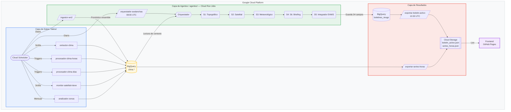

# Sistema Inteligente de Predicción de Riesgo de Avalanchas en Chile

Sistema multi-agente de inteligencia artificial que genera boletines de riesgo de avalanchas para zonas de montaña chilenas. El proyecto combina modelos físicos, imágenes satelitales, pronósticos meteorológicos y análisis contextual basado en Inteligencia Artificial (LLMs) para suplir la falta de redes de observación en terreno.

> **Tesis de Magíster en Tecnologías de la Información** > **Autor:** Francisco Peñailillo |  
> Universidad Técnica Federico Santa María (UTFSM) — 2026  

### 🌐 Demo en vivo

**[https://fpenailillo.github.io/Avalanche_AlertCL/](https://fpenailillo.github.io/Avalanche_AlertCL/)**

Interfaz web (Prueba de Concepto, beta) con los boletines EAWS por centro de montaña: nivel de peligro con íconos oficiales EAWS, problemas de avalancha, evolución a 72 h, pronóstico a 15 días (WeatherNext 2) y datos de los subagentes S1/S2/S4.

---

## El Problema

Las avalanchas representan uno de los peligros naturales de mayor impacto en las zonas cordilleranas de Chile. Cada invierno, los principales centros de ski y zonas de montaña de la Región Metropolitana (La Parva, Valle Nevado, El Colorado) y el sur del país reciben a decenas de miles de visitantes, quienes se exponen a un terreno que no cuenta con un sistema automatizado y centralizado de predicción.

A diferencia de los países alpinos (como Suiza o Austria) donde existen institutos que publican boletines diarios respaldados por cientos de estaciones de medición, en Chile la emisión de alertas es un desafío gigante. La escasez de estaciones meteorológicas de alta montaña y la ausencia de una red masiva de observación del manto nivoso dificultan la aplicación directa de las metodologías europeas.

## La Solución y el Aporte a la Comunidad

**Avalanche_AlertCL** nace para democratizar el acceso a la seguridad invernal. Al no contar con suficientes datos directos de la nieve, este proyecto propone un enfoque innovador: construir un sistema que infiere el riesgo a partir de **fuentes de datos indirectas** y el **conocimiento de la comunidad**.

Utilizando la orquestación de múltiples agentes de Inteligencia Artificial, el sistema recopila datos del clima, topografía, satélites y, de manera crucial, **relatos e informes de montañistas locales** (saberes humanos). Luego, procesa toda esta información simulando el razonamiento de un experto para emitir un boletín de riesgo estructurado bajo el estándar internacional **EAWS (European Avalanche Warning Services)**.

---

## Cómo Funciona: Arquitectura Conceptual

El sistema se divide en tres grandes etapas: la recolección de los datos, el procesamiento a través de agentes especializados en distintas disciplinas, y la generación del producto final.



## Los 5 Agentes Especializados
Para replicar el análisis multicapa que hace un experto humano, la IA está dividida en 5 subagentes, cada uno enfocado en una tarea específica:

S1 - Agente Topográfico: Analiza la forma de las montañas, la inclinación de las pendientes y la exposición al sol utilizando modelos digitales de elevación. Identifica las zonas estructuralmente propensas a deslaves.

S2 - Agente Satelital: Observa las montañas desde el espacio usando satélites (como Sentinel-2). Mide dónde hay nieve, hasta qué altura llega (línea de nieve) y busca anomalías.

S3 - Agente Meteorológico: Analiza pronósticos climáticos complejos y evalúa ventanas críticas como tormentas inminentes, cambios drásticos de temperatura o vientos fuertes que puedan mover la nieve.

S4 - Agente Contextual (Briefing): Analiza miles de relatos históricos y reportes recientes de montañistas para entender cómo se comporta la nieve en la realidad local y darle contexto humano a los datos fríos.

S5 - Agente Integrador EAWS: Es el "juez final". Toma las conclusiones de los cuatro agentes anteriores, evalúa la estabilidad, frecuencia y tamaño esperado de las avalanchas, y redacta el boletín final con el nivel de peligro (del 1 al 5).

## Cómo se ejecuta en producción

El sistema no es un servicio permanente: son **cuatro Cloud Run Jobs** que Cloud Scheduler
dispara a lo largo del día, todos sobre la misma imagen de contenedor.

| Job | Cuándo | Qué hace |
|---|---|---|
| `orquestador-avalanchas` | 08:00 UTC | Recorre S1→S5 por cada zona y guarda los boletines en BigQuery |
| `ingestor-wn2` | Diario | Ingesta el pronóstico ensemble de WeatherNext 2 |
| `exportar-boletin-activo` | 10:30 UTC | Reconstruye `boletin_activo.json` desde BigQuery y lo publica en GCS |
| `exportar-series-horas` | Diario | Publica las series horarias que consume el frontend |

La publicación va **desacoplada** a propósito: si el orquestador excede su `task-timeout`,
muere antes de publicar, pero los boletines ya están zona por zona en BigQuery. El job de
las 10:30 los recoge de todos modos, de forma que el frontend nunca se queda congelado.

**Los commits no despliegan el backend.** El workflow de GitHub Actions solo publica el
frontend en GitHub Pages. Para actualizar la imagen de los jobs hay que lanzar la build a
mano:

```bash
gcloud builds submit --config agentes/despliegue/cloudbuild.yaml .
```

## Desarrollo local

```bash
pip install -r requirements-dev.txt     # incluye las dependencias de ejecución
gcloud auth application-default login

pytest -m "not integration"             # unitarios: segundos, sin red
pytest                                  # suite completa: consulta BigQuery en vivo
```

La configuración de pytest vive en `pyproject.toml`, así que los tests funcionan desde
cualquier directorio. Los que necesitan credenciales GCP y red están marcados como
`integration`.

##  Estructura del Repositorio
Para quienes deseen explorar el código fuente, el proyecto está organizado de la siguiente manera:

/datos: Scripts y funciones en la nube (GCP) encargadas de extraer continuamente la información meteorológica, satelital y los relatos de la comunidad.

/agentes: El motor principal de la IA. Aquí reside la lógica de los 5 subagentes, su orquestación y la comunicación con los Modelos de Lenguaje (LLMs).

/frontend: Interfaz web (React + Vite + Tailwind) que muestra los boletines de riesgo. Se despliega automáticamente en [GitHub Pages](https://fpenailillo.github.io/Avalanche_AlertCL/) con cada push a `main`.

/notebooks_validacion: Entorno de investigación académica utilizado para comparar los resultados de la IA contra boletines de expertos humanos y validar las hipótesis de la tesis.

/docs: Documentación teórica, papers relevantes, fundamentos de la matriz EAWS y la propuesta original de la tesis. Los informes de validación por ronda están archivados en `docs/validacion/historico/`; `docs/auditoria_repositorio.md` recoge el estado del repositorio y lo que queda pendiente.

Las carpetas `historico/` (en `agentes/scripts/`, `datos/` y `docs/validacion/`) guardan material de un solo uso que la tesis cita como evidencia. No se ejecuta ni se mantiene: está ahí por trazabilidad.

####  Descargo de Responsabilidad > Este es un proyecto desarrollado con fines de investigación académica y pruebas de concepto. La información predictiva generada por esta Inteligencia Artificial es experimental y bajo ninguna circunstancia reemplaza el criterio humano experto, la capacitación adecuada ni el uso de equipos de seguridad en terreno (ARVA, pala, sonda). La montaña es un entorno dinámico y peligroso.
